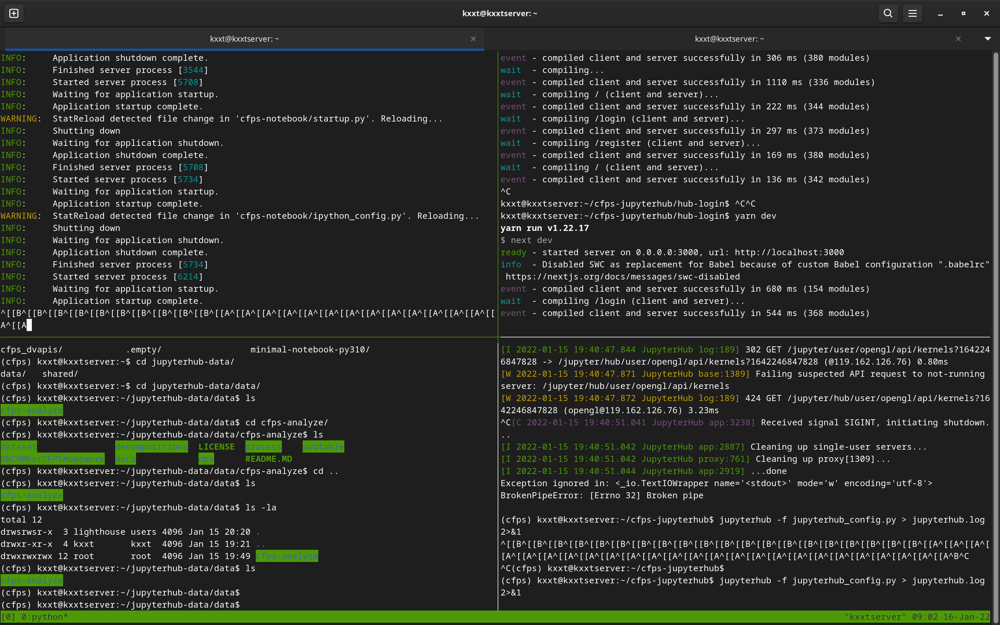

# CFPS JupyterHub

Shandong University (Weihai)

山东大学（威海）数据科学与人工智能实验班 （2020级）

2021 年秋 - 2022 年春 前端开发和数据库课程 大作业 第三部分

选题：JupyterHub

## 前言

根据 《山东大学学生违纪处分实施细则》分则

**第三十条** 违反学术纪律的，依照学校学术纪律处分规定予以处理。

根据 《 [山东大学学术纪律处分规定](https://www.rd.sdu.edu.cn/info/1675/8558.htm) 》 

**第一章 总则** 

**第二条**　本规定适用于所有以山东大学为作者单位发表（布）作品的人员，包括山东大学的教职工（以下简称“教师”）和学生,以及在山东大学学习、工作的访问学者、进修教师及兼职人员等。

**第二章 学术纪律** 

**第六条**　学生有下列行为之一的，可认定为违反山东大学学术纪律。
（一）第五条第（一）、（二）、（三）、（四）、（五）、（七）、（八）、（九）项所列行为。

**第五条（一）** 抄袭他人作品；与他人作品实质相似；在公开发表的作品中，使用他人成果不加注明。

**第三章 纪律处分**

**第八条**　违反学术纪律的学生，应当承担相应责任。

（一）有第五条第（一）、（二）、（三）、（四）项行为之一的，依情节轻重，给予记过、留校察看直至开除学籍处分。

请各位数科班同学不要抄袭大作业

## 安装

假设你在使用 Linux 系统，已经安装好了 Anaconda、Docker 和 Nginx，Node.js 和 Yarn

同时假设您已完成大作业的第一部分的配置，MySQL 跑在默认的端口 3306 上。

首先在主机上 Clone 这个 Repo，然后 `cd` 进去，运行：

```bash
conda env create -f environment.yml
conda activate cfps
pip install -r requirements.txt
cd hub-login
yarn install
cd ..
```

## 应用程序配置

### 环境变量配置

编辑 `.env` 文件，写入需要配置的环境变量

```bash
INVITE_CODES=邀请码，用;隔开，用户注册的时候需要
API_RATE_LIMIT=API调用频率上限，比如"30/minute"
API_SECRET_KEY=后端密钥
API_HUB_CLIENT_ID=JupyterHub客户端ID
API_HUB_CLIENT_SECRET=JupyterHub客户端密钥
APP_DOMAIN_NAME=部署域名
DOCKER_INTERFACE_IP=Docker 网卡 IP
APP_PROFILE=部署环境，可选值：dev(开发环境), prod(生产环境)
```

然后运行 `source load_env_vars.sh` 将 `.env` 文件中的环境变量加载到当前 shell 中

### 配置存储

我们创建两个 docker volume，一个用来存储只读的共享数据，另一个用来存储所有用户都可读写的数据。

> 注：每个用户的私有存储将会自动创建，无需手动配置

```bash
mkdir -p /home/$USER/jupyterhub-data/{data,shared}
docker volume create --driver local -o o=bind -o type=none -o device="/home/$USER/jupyterhub-data/data" cfps-common-data
docker volume create --driver local -o o=bind -o type=none -o device="/home/$USER/jupyterhub-data/shared" cfps-team-shared
```

然后将大作业的 [第一部分](https://github.com/lie-flat/cfps-analyze) 的代码和数据复制到 `/home/$USER/data` 中, 目录结构应该如下：

其中，dataset 目录的结构应该根据 https://github.com/lie-flat/cfps-analyze/blob/master/README.MD 进行配置

根据相关保密要求，我们不能提供 CFPS 数据集文件，请从官方渠道申请并下载。

此 Repo 的 `cfps_dvapis` 文件夹和 `on_container_start_up.sh` 也应该被复制到 `/home/$USER/jupyterhub-data/data` 中

这个 Repo 的 notebooks 目录下是示例笔记本文件，也应当把这个目录拷贝过去。

```
/home/$USER/jupyterhub-data/data
├── cfps-analyze
│   ├── dataset
│   ├── process
│   ├── docs
│   ├── .gitignore
│   ├── .gitmodules
│   ├── .whitesource
│   ├── LICENSE
│   ├── README.MD
│   └── requirements.txt
├── cfps_dvapis
|   └── ...
├── notebooks
|   └── ...
└── on_container_start_up.sh
```

注意要赋予 `on_container_start_up.sh` 可执行权限


## 系统配置

（假设你所使用的系统用户已在 `docker` 组中，如果没有，请运行：`sudo usermod -aG docker $USER`） 提前下载好我制作的容器镜像

```bash
docker pull rsworktech/cfps-notebook:latest
```

允许 Docker 容器访问主机的 8081 端口和部署在 3306 端口的 MySQL

```bash
sudo iptables -A INPUT -i docker0 -p tcp -m tcp --dport 8081 -j ACCEPT
sudo iptables -A INPUT -i docker0 -p tcp -m tcp --dport 3306 -j ACCEPT
```

持久化 iptables 的设置，防止重启系统之后上面的设置失效

如果没有安装 `iptables-persistent`, 则先运行 `sudo apt install iptables-persistent`

```bash
sudo dpkg-reconfigure iptables-persistent
```

生成 Nginx 配置

```bash
conda activate cfps
python generate_nginx_conf.py
```

安装 Nginx 配置并启用

```bash
sudo cp hub.kxxt.tech.conf /etc/nginx/sites-available/
sudo ln -s /etc/nginx/sites-available/hub.kxxt.tech.conf /etc/nginx/sites-enabled/hub.kxxt.tech.conf
```

配置 SSL 证书 (假设你已经装好了 `certbot`)

```bash
(cfps) kxxt@kxxtserver:~/cfps-jupyterhub$ sudo certbot
Saving debug log to /var/log/letsencrypt/letsencrypt.log

Which names would you like to activate HTTPS for?
- - - - - - - - - - - - - - - - - - - - - - - - - - - - - - - - - - - - - - - -
5: hub.kxxt.tech
- - - - - - - - - - - - - - - - - - - - - - - - - - - - - - - - - - - - - - - -
Select the appropriate numbers separated by commas and/or spaces, or leave input
blank to select all options shown (Enter 'c' to cancel): 5
Requesting a certificate for hub.kxxt.tech

Successfully received certificate.
Certificate is saved at: /etc/letsencrypt/live/hub.kxxt.tech/fullchain.pem
Key is saved at:         /etc/letsencrypt/live/hub.kxxt.tech/privkey.pem
This certificate expires on 2022-04-14.
These files will be updated when the certificate renews.
Certbot has set up a scheduled task to automatically renew this certificate in the background.

Deploying certificate
Successfully deployed certificate for hub.kxxt.tech to /etc/nginx/sites-enabled/hub.kxxt.tech.conf
Congratulations! You have successfully enabled HTTPS on https://hub.kxxt.tech
```

## 数据库配置

假设你已经根据大作业的第一部分将数据导入了 MySQL, MySQL 运行在同一台服务器上。

为 JupyterHub 的用户创建一个数据库账户

```bash
sudo mysql
# 下面的 172.17.0.% 为 Docker 容器在 Docker 网卡上的 IP, 请根据实际情况设置
CREATE USER 'jupyterhub'@'172.17.0.%' IDENTIFIED BY 'SUPER-secret_PlavsW0r1d';
# 授予在 cfps 数据库上的 SELECT 权限（只读，防止用户篡改数据）
GRANT SELECT ON cfps.* TO 'jupyterhub'@'172.17.0.%';
FLUSH PRIVILEGES;
```

## 启动应用程序

### 调试模式和生产模式

在调试模式下，程序会因为源代码文件的改动而自动重新加载，比较适合开发时使用。

编辑 `.env` 文件， 将 `APP_PROFILE` 改为 `dev` 或 `prod`

我们推荐您使用 `tmux` 来管理会话 (`sudo apt install tmux`)

~~当然你用 `screen` 也可以~~。



新开一个 tmux 会话，分成三块 pane：

```bash
tmux
```

然后按下组合键

```
C-b %  # 水平分屏
C-b "  # 垂直分屏
```

> 这里 `C-b %` 指先按下 <kbd>Ctrl</kbd> + <kbd>B</kbd>, 然后输入 % （即按下 <kbd>Shift</kbd> + <kbd>5</kbd>）
> 本文出现的其他的按键组合同理

在三个 pane 中都执行如下操作, 方法如下

```bash
C-b :
setw synchronize-panes on # 此处有 Tab 补全，不用傻傻的一个字一个字的敲。。。
```

然后执行

```bash
cd cfps-jupyterhub  # 进入到此 Repo 的目录
conda activate cfps  # 激活 conda 环境
source load_env_vars.sh  # 加载环境变量
```

然后退出同步执行模式：

```bash
C-b :
setw synchronize-panes off # 此处有 Tab 补全，不用傻傻的一个字一个字的敲。。。
```

重新生成 Nginx 配置文件并部署

```
python generate_nginx_conf.py
sudo rm /etc/nginx/sites-available/hub.kxxt.tech.conf
sudo cp hub.kxxt.tech.conf /etc/nginx/sites-available/hub.kxxt.tech.conf
sudo systemctl reload nginx
```

然后重新配置 SSL, 选 1, 重新安装即可，无需 Renew

```bash
sudo certbot
- - - - - - - - - - - - - - - - - - - - - - - - - - - - - - - - - - - - - - - -              
1: Attempt to reinstall this existing certificate                                            
2: Renew & replace the certificate (may be subject to CA rate limits)                        
- - - - - - - - - - - - - - - - - - - - - - - - - - - - - - - - - - - - - - - -              
Select the appropriate number [1-2] then [enter] (press 'c' to cancel): 1                    
Deploying certificate
Successfully deployed certificate for hub.kxxt.tech to /etc/nginx/sites-enabled/hub.kxxt.tech.conf
Congratulations! You have successfully enabled HTTPS on https://hub.kxxt.tech                
```

然后运行 JupyterHub, 把日志保存在 `jupyterhub.log`

```bash
jupyterhub -f jupyterhub_config.py &> jupyterhub.log
```

然后切换到另一个 pane (<kbd>Ctrl</kbd> + <kbd>B</kbd>, 然后按方向键)

运行后端服务, 把日志输出到 `backend.log`：

```bash
python server.py &> backend.log
```

然后切换到最后一个 pane，配置一下前端：

如果是调试模式，就启动 Next.js Server：

```bash
cd hub-login
yarn dev
```

如果是生产模式，把静态网站构建出来就可以了

```bash
cd hub-login
yarn build
```

好了，现在整个程序应该都跑起来了！

按下 <kbd>Ctrl</kbd> + <kbd>B</kbd> , 然后按下 <kbd>d</kbd>, 可以与当前的 tmux 会话分离

使用 `tmux attach` 命令可以重新进入原来的 tmux 会话